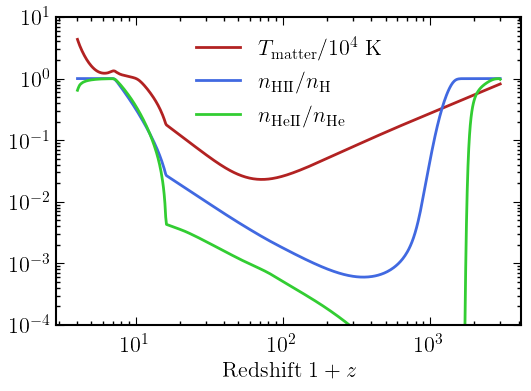

# DarkHistory

<!-- [](https://travis-ci.org/hongwanliu/DarkHistory) -->
[](https://arxiv.org/abs/1904.09296)
[](https://readthedocs.org/projects/darkhistory/)

DarkHistory is a Python code package that calculates the global temperature and ionization history of the universe given an exotic source of energy injection, such as dark matter annihilation or decay. DarkHistory is described in a paper available at [arXiv:1904.09296](https://arxiv.org/abs/1904.09296). Please cite this paper if you use DarkHistory in a scientific publication. For detailed information, please visit our readthedocs webpage [here](https://darkhistory.readthedocs.io).

# Installation
*Updated 2024/10/13*

- Clone this repository and checkout the branch you wish to use. The currently active branches are: `master`, `lowengelec_upgrade`, and `early_halo_cooling`.
- Create a new virtual environment for DarkHistory (recommended). For example, using `conda`:
```bash
conda create -n darkhistory python=3.12 pip
conda activate darkhistory
```
- Install the package via `pip` in the *DarkHistory/* directory
```bash
pip install .
```
- Download the [data files](https://doi.org/10.5281/zenodo.13259509) required to run DarkHistory and save them to a preferred location.
- Inform DarkHistory of the data files' location by either:
  - Setting the environment variable `DH_DATA_DIR` to the directory containing data files,
  - Setting the variable `data_path_default` in *darkhistory/config.py* directly.

DarkHistory is now ready to use. You can test your installation with the example code below. Additionally, familiarize yourself with DarkHistory by exploring the notebooks in the *examples/* directory.

Recent updates (See [CHANGELOG](CHANGELOG.md) for details.):
- 2024/10/13: Custom injection updated.
<!-- - 2024/10/13: Updated dataset by downgrading float128 arrays to float64. -->
- 2024/10/13: Updated scipy dependency (removed `interp2d`).
- 2024/10/04: Please make sure to set cosmology parameters in *darkhistory/physics.py* consistent with your purpose! The current `master` branch may have updated parameters compared to earlier versions.
- 2024/08/12: For versatility, all data files required to use DarkHistory have been converted to either HDF5, JSON, or plain text files. All active branches of DarkHistory (`master`, `lowengelec_upgrade`, and`early_halo_cooling`) have been updated to use the new set of data files. You can download the new data files at the [following link](https://doi.org/10.5281/zenodo.13259509). See below for older datasets.

# Available Versions

## [DarkHistory v1.1.2](https://github.com/hongwanliu/DarkHistory) for [DM21cm](https://github.com/yitiansun/DM21cm)

The version of DarkHistory used in [DM21cm](https://github.com/yitiansun/DM21cm), a semi-numerical simulation of inhomogemeous dark matter energy injection based on DarkHistory and [21cmFAST](https://github.com/joshwfoster/21cmFAST). DM21cm is described in [arXiv:2312.11608](https://arxiv.org/abs/2312.11608). Branch: `master`.

## [DarkHistory v2.0](https://github.com/hongwanliu/DarkHistory/releases/tag/v2.0.0), with improved treatment of low energy electrons and spectral distortions

The branch containing the upgraded treatment for low energy electrons and spectral distortions can be found [here](https://github.com/hongwanliu/DarkHistory/tree/lowengelec_upgrade). In additional to the data files needed for v1.0, this upgrade requires [additional data files](https://doi.org/10.5281/zenodo.7651517).

The upgrades are described in a paper available at [arXiv:2303.07366](https://arxiv.org/abs/2303.07366), and examples of applications are given in [arXiv:2303.07370](https://arxiv.org/abs/2303.07370). Please cite these as well as [arXiv:1904.09296](https://arxiv.org/abs/1904.09296) if you use this version of DarkHistory in a scientific publication. Branch: `lowengelec_upgrade`.

## [DarkHistory v1.1](https://github.com/hongwanliu/DarkHistory/releases/tag/v1.1.0) with Neural Network transfer functions

Added Neural Network transfer functions to optionally replace large tabulated transfer functions. Requires [Tensorflow 2.0](https://www.tensorflow.org/install) in addition to v1.0 dependencies, and a [compact dataset](https://doi.org/10.5281/zenodo.6819281) to use the Neural Network transfer functions. (To upgrade from v1.0, one can simply add the compact dataset to the existing data directory). To use the tabulated transfer functions, a [full dataset](https://doi.org/10.5281/zenodo.6819310) is required. (This version of DarkHistory also works with v1.0 dataset with setting `use_v1_0_data=True` in config.py.)

The update is described in a paper available at [arXiv:2207.06425](https://arxiv.org/abs/2207.06425). Please cite this paper as well as [arXiv:1904.09296](https://arxiv.org/abs/1904.09296) if you use this version of DarkHistory in a scientific publication. The release for this version can be found [here](https://github.com/hongwanliu/DarkHistory/releases/tag/v1.1.0).

## [DarkHistory v1.0](https://github.com/hongwanliu/DarkHistory/releases/tag/v1.0.0)

First release of DarkHistory. DarkHistory v1.0 is described in a paper available at [arXiv:1904.09296](https://arxiv.org/abs/1904.09296). Please cite this paper if you use DarkHistory in a scientific publication. The data files for required for this version can be found [here](https://doi.org/10.7910/DVN/DUOUWA). The release for this version can be found [here](https://github.com/hongwanliu/DarkHistory/releases/tag/v1.0.0). For more information, please visit our webpage [here](https://darkhistory.readthedocs.io).

# Example usage

```python
from darkhistory.main import evolve
import darkhistory.physics as phys

solution = evolve(
    DM_process = 'decay',   # 'decay' or 'swave'
    mDM = 1e8,              # [eV]
    lifetime = 3e25,        # [s]
    primary = 'elec_delta', # primary decay channel
    start_rs = 3000,        # starting 1+z
    coarsen_factor = 12,    # log(1+z) would change by 0.001 * coarsen_factor for next step
    backreaction = True,    # Enables injection backreaction on matter temperature and ionization.
    helium_TLA = True,      # Enables the Helium Three Level Atom (TLA) solver.
    reion_switch = True,    # Enables a customizable reionization energy injection.
)

import matplotlib.pyplot as plt

plt.plot(solution['rs'], solution['Tm'] / (1e4*phys.kB), 'firebrick', label=r'$T_\mathrm{matter}/10^4$~K')
plt.plot(solution['rs'], solution['x'][:, 0], 'royalblue', label=r'$n_\mathrm{HII}/n_\mathrm{H}$')
plt.plot(solution['rs'], solution['x'][:, 1] / phys.chi, 'limegreen', label=r'$n_\mathrm{HeII}/n_\mathrm{He}$')
plt.xlabel(r'Redshift $1+z$')
plt.ylim(1e-4, 1e1)
plt.loglog()
plt.legend(frameon=False)
```
Example output: \
[2024-10-12 23:01:05,651] INFO: darkhistory.config: Loaded deposition transfer functions. \
[2024-10-12 23:01:10,374] INFO: darkhistory.config: Loaded ICS transfer functions. \
[2024-10-12 23:01:10,493] INFO: darkhistory.main: Starting evolution from rs = 3000.00 to rs = 4.00. \
100%|██████████| 552/552 [02:27<00:00,  3.75it/s]
<p align="left"></p>
